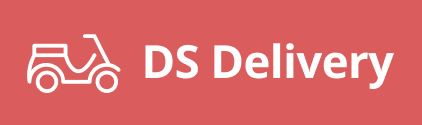
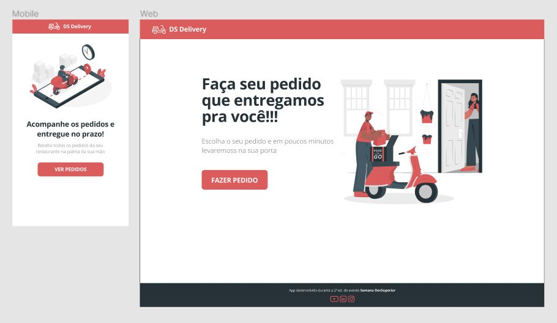

<h1 align="center">
    
    <br>Semana DevSuperior 2.0<br/>
    Spring Boot | ReactJS | React Native
</h1>

<p align="center">
    
    
    
    <br/>
</p>

<p align="center">
    <a href="#bookmark-sobre-o-projeto">Sobre</a>&nbsp;&nbsp;&nbsp;|&nbsp;&nbsp;&nbsp;
    <a href="#rocket-tecnologias-utilizadas">Tecnologias</a>&nbsp;&nbsp;&nbsp;|&nbsp;&nbsp;&nbsp;
    <a href="#boom-como-executar">Como Executar</a>&nbsp;&nbsp;&nbsp;|&nbsp;&nbsp;&nbsp;
    <a href="#memo-licença">Licença</a>
</p>

<p align="center">
    
<p>

## :bookmark: Sobre o Projeto

O **DS Delivery** é uma aplicação Web e Mobile para usuários que desejam realizar registros e entregas de pedidos. Na parte Web se encontram etapas que o usuário deve seguir para realização de pedidos, já no Mobile está relacionado as estregas dos pedidos, possuindo uma interface muito bem informada dos pedidos e fácil de se utilizar.

Essa aplicação foi realizada durante a **Semana DevSuperior 2.0**, projeto da [DevSuperior](https://devsuperior.com.br/).

## :rocket: Tecnologias Utilizadas

- [Axios](https://github.com/axios/axios)
- [Expo](https://expo.io/)
- [Java](https://www.java.com/)
- [Leaflet](https://leafletjs.com/)
- [NPM](https://www.npmjs.com/)
- [Mapbox](https://www.mapbox.com/)
- [Postgresql](https://www.postgresql.org/)
- [ReactJS](https://reactjs.org/)
- [React Native](http://facebook.github.io/react-native/)
- [React Navigation](https://reactnavigation.org/)
- [React Select](https://react-select.com/)
- [React Toastify](https://fkhadra.github.io/react-toastify/)
- [Spring Boot](https://spring.io/)
- [TypeScript](https://www.typescriptlang.org/)

## :boom: Como Executar

- ### **Pré-requisitos**

  - É **necessário** possuir o **[Java 11](https://www.java.com/)** e **[Spring Boot](https://spring.io/)** instalados no computador.
  - É **necessário** possuir o **[Git](https://git-scm.com/)** instalado e configurado no computador.
  - É **vital** ter a **[IDE Eclipse](https://spring.io/tools)** instalado no computador para subir o backend.
  - Também, é **preciso** ter um gerenciador de pacotes seja o **[Yarn](https://yarnpkg.com/)** ou **[NPM](https://www.npmjs.com/)**.
  - Por fim, é **essencial** ter o **[Expo](https://expo.io/)** instalado de forma global na máquina.

1. Faça um clone do repositório:

```sh
  $ git clone https://github.com/DanielAraldi/DS-Delivery.git
```

2. Executando a Aplicação:

```sh
  # API
  # Para subir o backend é necessário:
  # > Ir no Spring Tool Suite (STS)
  # > Abrir a pasta dsdelivery
  # > Clicar com o botão direito em src/main/java
  # > Procurar por "Run As" e ir na opção "Spring Boot App"

  # APLICAÇÃO WEB
  $ cd frontend
  # Instalando as dependências do projeto.
  $ npm install # ou yarn install
  # Inicie a aplicação web
  $ npm run start # ou yarn start

  # APLICAÇÃO MOBILE
  $ cd mobile
  # Instalando as dependências do projeto.
  $ npm install # ou yarn install
  # Inicie a aplicação mobile
  $ npm run start # ou yarn start
```

## :memo: Licença

Esse projeto está sob a licença MIT. Veja o arquivo [LICENSE](LICENSE) para mais detalhes.

---

<sup>Projeto desenvolvido com a tutoria de [Nelio Alves](https://github.com/acenelio) e [Washington Soares](https://github.com/washingtonsoares), da [DevSuperior](https://devsuperior.com.br/).</sup>
